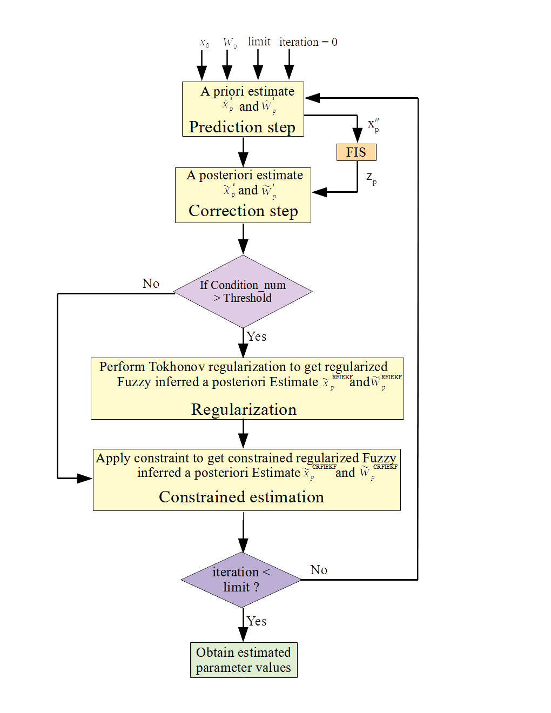

# PARAMETER-ESTIMATION-OF-BIOCHEMICAL-PATHWAY

## Motivation:
The trajectory of various molecules, involved in biochemicalpathways, depends on severalparameters, such as rate constant and Michaelis Menten constant among others. Most of such parametersare unknown to us. Previous studies including hybrid extended Kalman filter (HEKF), a modified version ofextended Kalman filter (EKF), need experimental time course observations/measurements to accomplishparameter estimation efficiently. However, such observations maynot always be readily available. Here,a novel fuzzy inference system (FIS) based method Constrained Regularized Fuzzy Inferred ExtendedKalman Filter (CRFIEKF) has been introduced to estimate unknown parameters of biochemical pathwayswithout prior knowledge of experimental transient observations. However, the relationships among differentmolecules, involved in the pathway need to be known. The FIS captures such relations with the notion offuzzy logic.

## Algorithm
The algorithm has mainly two steps,  i.e.,  “prediction” and“correction”. During prediction, the system states, as wellaserror covariance matrix, are estimated without considering theknown measurement of states at the present instant. Thus thestate estimation in the first step of CRFIEKF can be consideredas a priori estimate. On the other hand, in the second step, apriori estimate has been improved according to the known currentmeasurement of states. The corrected estimation can be consideredas a posteriori estimate. Subsequently, the current a priori errorcovariance estimate has been evaluated by integrating a differential Lyapunov equation considering the previous a posteriori errorcovariance as initial condition (31). However, to accomplish aposteriori estimate efficiently, an appropriate measurement signalat every time instant based on experimental observations shouldbe provided. As no such experimental observations are available,we have generated the required measurements with the help ofFIS depending on the known fuzzy relationships among differentmolecules. However, the ill-conditioned observation matrix mayresult in a high deviation of estimated parameter values from itstrue value. In order to ensure the possibility of an ill-conditionedobservation matrix we have evaluated the condition number ofthe normal matrix (illustrated in the previous section). Highcondition number implies more deviation of estimated value fromits true value. Thus we have regularized the estimated parametersdepending upon a threshold. Finally, we have applied a constrainedestimation technique to estimate the parameter values biologicallyrelevant. The algorithm is pictorially demonstrated in the figure below. 

## Software requirment:
Following are software packages that may be used to run the proposed algorithm

 - Matlab version: 2018a or later.
 - Fuzzy inference system toolbox.
 
## Hardware Requirement:  
 - Intel(R) Core(TM) i5-4440 cpu @ 3.10GHz or similar or later version.
 - 4.00 GB RAM or more.

## Results:
We first evaluated the efficacy of the method on a Generic branch pathway model. Afterwords, we have applied the technique on Glycolysis pathway of human erythrocytes. In order to validate the model, based on parameter values estimated by the proposed method,we have compared the behavior of eight metabolites of glycolysis pathway with CE-MS measurement and previous simulation results related to hypoxia. In addition, we have investigated the proposed methodologyon estimating parameter values involved in JAK/STAT and Ras/Raf/MEK/ERK signal transduction pathways of different cells. All such cases have shown similar transient behavior of the molecules with previous *in vivo* and *in silico* results. The comparison of dynamics behaviour are given in the supplementary file.

## How to run: 
Run the parameter_estimation_mother_file.m from MATLAB terminal. All the other necessery files will run automatically.

## Repository structure:  
The repository contains a number of folders. The description about the folders are given below. 
- **1)	General Glycolysis pathway:** This folder contains the matlab files and FIS files tp estimation of parameter of glycolysis pathway of human erythrocytes. 
- **2) Generic branch pathway:** This folder contains the matlab files and FIS files tp estimation of parameter of a generic branch pathway model.
- **3) IL6 dependent Jak-STAT3 pathway:** This folder contains the matlab files and FIS files tp estimation of parameter of IL6 dependent Jak-STAT3 pathway.
- **4)	JAK/STAT pathway:** This folder contains the matlab files and FIS files tp estimation of parameter of JAK/STAT signaling pathway.
- **5)	Ras pathway:** This folder contains the matlab files and FIS files tp estimation of parameter of Ras signaling pathway.
- **6) Yeast glycolysis pathway:** This folder contains the matlab files and FIS files tp estimation of parameter of glycolysis pathway of yeast cell.
